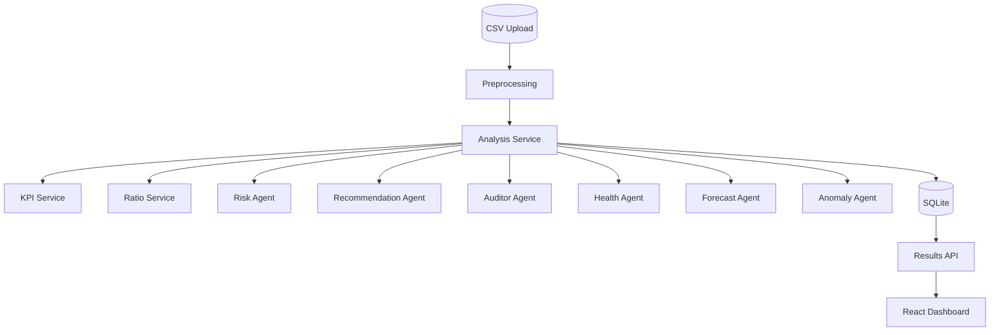

# AI-CFO: Multi-Agent Financial Intelligence Platform

AI-CFO is a full-stack financial analysis platform that turns uploaded monthly business data into executive-friendly insights. The backend processes CSV uploads, computes KPIs and ratios, classifies risk, generates recommendations, produces chart-ready forecasts, detects anomalies, and stores each run in SQLite for later review.

## What It Does

- Accepts SME finance CSV uploads with monthly revenue and expense columns
- Cleans and normalizes uploaded data before analysis
- Computes business KPIs such as revenue, expenses, profit, and profit margin
- Forecasts future revenue with a layered fallback strategy
- Detects unusual financial behavior with ML and rule-based fallback logic
- Produces a health score and risk classification
- Stores analysis runs and serves frontend-ready dashboard results

## Current ML and Analytics Layer

The backend uses a hybrid analytics pipeline rather than a single black-box model:

- Forecasting:
  - `Prophet` when available
  - `ARIMA` when Prophet is unavailable or fails
  - linear trend baseline as a final fallback
- Anomaly detection:
  - `IsolationForest` over numeric financial features
  - rule-based fallback for significant revenue drops if ML is unavailable or fails
- Health score:
  - rule-based score built from profitability, revenue stability, expense efficiency, and risk penalty
- Auditor summary:
  - Gemini-based executive summary when `GEMINI_API_KEY` is configured
  - rule-based narrative fallback when the LLM is unavailable

## Architecture



## Project Structure

```text
├── backend/
│   ├── app/
│   │   ├── agents/       # Forecasting, anomaly, risk, health, auditor, recommendations
│   │   ├── routes/       # API endpoints for analyze, session, results, runs
│   │   ├── services/     # Preprocessing, KPI, and ratio logic
│   │   ├── db.py         # Database setup
│   │   ├── main.py       # FastAPI app entrypoint
│   │   └── models.py     # SQLAlchemy models
│   ├── requirements.txt
│   ├── test_pipeline.py
│   └── Dockerfile
├── frontend/
│   ├── src/
│   │   ├── api/
│   │   ├── components/
│   │   ├── context/
│   │   ├── hooks/
│   │   └── pages/
│   └── Dockerfile
├── data/
├── docker-compose.yml
└── README.md
```

## Backend Flow

The main analysis pipeline runs in this order:

1. Preprocess uploaded CSV data
2. Calculate KPIs
3. Calculate financial ratios
4. Assess risk
5. Generate recommendations
6. Generate auditor summary
7. Calculate health score
8. Produce forecast data
9. Detect anomalies

The result is then compressed, stored in SQLite, and exposed to the frontend through the results API.

## Data Format

The backend expects a CSV with a monthly time column plus revenue and expense categories.

Supported time column:

- `months`
- `date` (automatically normalized to `months`)

Typical columns:

```text
months,revenue,rent,salaries,marketing,subscriptions,utilities,other
```

Notes:

- column names are normalized to lowercase
- empty and unnamed columns are removed
- numeric fields are coerced safely
- duplicate months are aggregated
- missing monthly gaps are interpolated when the timeline is incomplete

## API Overview

Main backend routes:

- `GET /` - backend status message
- `GET /health` - health check
- `POST /session/start` - create a session
- `POST /analyze/analyze?session_id=...` - upload and analyze a CSV
- `GET /results/{run_id}` - fetch dashboard-ready results
- `GET /results/{run_id}/{agent}` - fetch a specific stored result section
- `GET /runs/{session_id}` - fetch previous runs for a session

Current results payload includes:

- KPIs
- health score
- risk details
- forecast history and future values
- recommendations
- auditor summary
- anomalies

## Tech Stack

- Frontend:
  - React
  - Vite
  - Tailwind CSS
- Backend:
  - FastAPI
  - SQLAlchemy
  - Pandas
  - SQLite
- ML and analytics:
  - Prophet
  - statsmodels
  - scikit-learn
  - NumPy
  - optional Google Generative AI integration for the auditor summary
- DevOps:
  - Docker
  - Docker Compose

## Setup

### Prerequisites

- Docker and Docker Compose
- or Python 3.11+ and Node 18+

### Docker

1. Clone the repository
2. Create `backend/.env`
3. Add your Gemini key if you want the LLM auditor enabled:

```env
GEMINI_API_KEY=your_key_here
```

4. Start the stack:

```bash
docker compose up --build
```

### Local Backend

```bash
cd backend
python -m venv venv
venv\Scripts\activate
pip install -r requirements.txt
uvicorn app.main:app --reload
```

### Local Frontend

```bash
cd frontend
npm install
npm run dev
```

## Example Analysis Output

The analysis pipeline returns business-friendly output built for the dashboard:

- `kpi`
- `ratios`
- `risk`
- `recommendations`
- `health_score`
- `auditor`
- `forecast`
- `anomalies`

The stored results endpoint reshapes that data for cards, charts, and insight panels on the frontend.

## Recent Changes Reflected Here

- Forecasting now uses a safer optional-import fallback path so the backend can still run when advanced ML libraries are missing
- Anomaly detection now excludes time columns from ML features and only falls back to rule-based logic on actual ML failure
- Preprocessing now accepts both `months` and `date` time columns more safely
- Debug prints were removed from preprocessing
- Anomalies are now included in stored and returned API results
- Health score behavior is documented as a rule-based scoring model

## Limitations

- Forecasting uses safe default model settings rather than dataset-specific tuning
- Anomaly detection is unsupervised and not trained on labeled fraud or failure events
- Health score is rule-based, not learned from historical outcomes
- Risk classification is partly heuristic and tied to current threshold logic

## Summary

AI-CFO is designed as a modular and explainable financial intelligence system. Its strength is not just model usage, but the way forecasting, anomaly detection, KPI logic, risk scoring, and recommendations work together to turn raw spreadsheets into actionable business insight.
