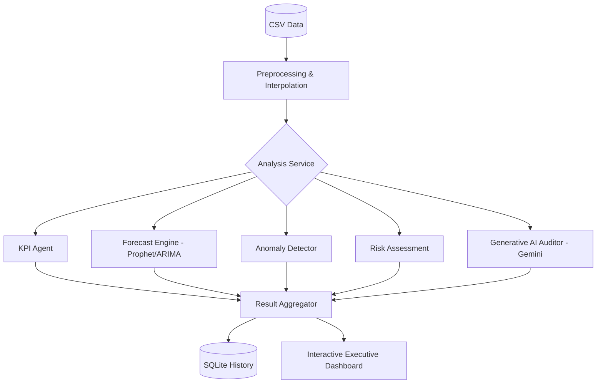

# 💼 AI-CFO: Multi-Agent Financial Intelligence Platform

AI-CFO is a production-grade, multi-agent financial decision support system that transforms raw financial data into professional-grade executive intelligence. By orchestrating a fleet of specialized AI agents, the platform provides automated auditing, seasonal forecasting, and actionable strategic recommendations.

---

## 🚀 Key Features

### 🧠 Generative AI Auditor
- **Gemini 1.5 Flash Integration:** Delivers human-readable, executive-level summaries of complex financial patterns.
- **Rule-Based Fallback:** Ensures 100% uptime with a robust logic-tree explanation system if API limits are reached.

### 📈 Advanced Forecasting Engine
- **Multi-Model Waterfall:** Uses **Facebook Prophet** for seasonality, falling back to **ARIMA** for statistical trends, and **Linear Regression** for baseline growth.
- **Margin Visualization:** Simultaneously projects Revenue and Expenses to visualize historical and future profit gaps.

### 🛡️ Managed Risk & Anomaly Detection
- **Statistical Guarding:** Identifies Z-score anomalies in operational spending.
- **Risk Flagging:** Automated detection of margin compression, high expense volatility, and revenue stagnation.

### 💎 Premium User Experience
- **Glassmorphism UI:** A stunning, responsive interface with Midnight and Void (amoled) themes.
- **Interactive Recharts:** Dynamic, hover-enabled visualizations for ledger breakdowns and time-series trends.
- **History Sidebar:** Persistent tracking of all past analysis runs stored in a local SQLite database.
- **PDF Export:** CFO report generation with clean, professional print-media formatting.

---

## 🧩 System Architecture



---

## ⚙️ Tech Stack

- **Frontend:** React, Tailwind CSS, Recharts, Lucide Icons, Context API.
- **Backend:** FastAPI (Python 3.11), SQLAlchemy, Pandas.
- **ML Layer:** Facebook Prophet, Statsmodels, Scikit-learn, Google Generative AI SDK.
- **DevOps:** Docker, Docker Compose.

---

## 📂 Project Structure

```text
├── frontend/             # React SPA (Vite)
│   ├── src/components/   # Modular UI elements
│   ├── src/pages/        # Dashboard, Forecast, Ledger views
│   └── Dockerfile        # Frontend container config
├── backend/              # FastAPI Server
│   ├── app/agents/       # Specialized AI logic
│   ├── app/routes/       # REST API Endpoints
│   ├── aicfo.db          # Persistence (SQLite)
│   └── Dockerfile        # Python container config
└── docker-compose.yml    # Full stack orchestration
```

---

## 🛠️ Getting Started

### Prerequisites
- Docker & Docker Compose **(Recommended)**
- OR Python 3.11+ & Node 18+

### Fast Track (Docker)
1. Clone the repository.
2. Create `backend/.env` and add:
   ```env
   GEMINI_API_KEY=your_key_here
   ```
3. Run the orchestration:
   ```bash
   docker compose up --build
   ```

### Local Setup
**Backend:**
```bash
cd backend
python -m venv venv
source venv/bin/activate  # venv\Scripts\activate on Windows
pip install -r requirements.txt
uvicorn app.main:app --reload
```

**Frontend:**
```bash
cd frontend
npm install
npm run dev
```

---

## 📊 Sample Data Format
The system accepts CSV files with the following columns:
`months` (or `date`), `revenue`, `rent`, `salaries`, `marketing`, `subscriptions`, `utilities`, `other`.

---

## 🎯 Future Roadmap
- [ ] Direct integration with ERP APIs (Stripe, QuickBooks).
- [ ] Multi-user team workspaces and RBAC.
- [ ] Scenario Simulation "What-If" Playground.

---

## 🧠 Summary
AI-CFO is designed as an intelligent, explainable, and modular financial system that assists businesses in making better financial decisions using AI-driven insights. It bridges the gap between raw spreadsheets and executive-level strategy.

---

## 🧪 Testing and CI/CD

This project uses **Pytest** for backend testing and **Vitest** for frontend testing. A GitHub Actions CI pipeline is configured to run tests and linters automatically on pull requests to the `main` branch.

### Running Backend Tests
Navigate to the backend directory and run:
```bash
pytest --cov=app --cov-report=term-missing
```

### Running Frontend Tests
Navigate to the frontend directory and run:
```bash
npm run test
```

### Docker Testing Services
You can also run the tests through Docker Compose using the dedicated test services:
```bash
docker compose run backend-tests
docker compose run frontend-tests
```
